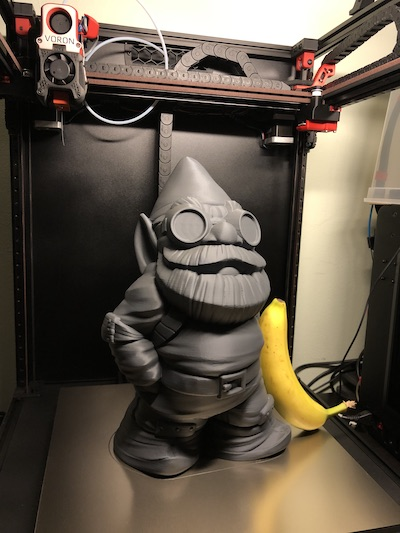

# Voron 2.4-300mm build
Klipper configuration for my Voron 2.4 printer (300x300x300)

_* banana for reference_

## Setup
I'm running [klipper firmware](https://github.com/KevinOConnor/klipper) on a RaspberryPi4 connected via usb to two SKR 1.4 turbo board.

### Klipper and Octoprint
The process is pretty straight-forward: run the klipper dependencies installer, compile the firmware and flash it on the board. Install an octoprint plugin. It's done :)

Please refer to the [offical documentation](https://www.klipper3d.org/Overview.html) for details.

## Contributing

This project, even if personal, it's meant open so feel free to contribute! 
These are the [contribution guidelines](CONTRIBUTING.md).

This has been forked from rpanfili/voron-ht
